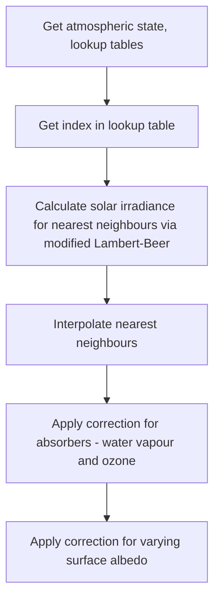

# Some notes on physics

## SpecMAGIC-NOW

This code is a refactor of the SpecMAGIC-Now algorithm produced by Richard Mueller et al. at DWD.

## Rough overview



## The spectral method

Previous iterations of SpecMAGIC-Now have worked in broadband, as this was suitable for the satellite at the time (Meteosat First Generation). The legacy code contains the option to swap between broadband and spectral options. This has not been ported forward to the new code.

The MAGIC code calculates irradiance values in bins of Kato wavelength bands. [This article by Kato et al ](https://www.sciencedirect.com/science/article/pii/S0022407398000752)(1999) introduces the bands and the concept behind them.

In principle, it should be possible to to resolve the GHI at arbitrarily small spectral intervals (dependent on sufficient memory). However, spectrally resolved input data are not always easy to find and are often given in the Kato wavelength bands.

## Land classes

The land class input data use some potentially cryptic codes which are handcoded into the program. The `Reflectivity` namespace contains several arrays that look like the below.

```cpp
static constexpr MAGIC_REAL d[20] = {
    0.40, 0.44, 0.32, 0.39, 0.22,
    0.28, 0.40, 0.47, 0.53, 0.53,
    0.35, 0.41, 0.10, 0.40, 0.10,
    0.40, 0.41, 0.58, 0.10, 0.10
};
```

There are 20 types of land. Each of these entries corresponds to a value of the given class. These are taken directly from the legacy code.

The table below shows the 20 land classes.

| Index | Land type |
|-------|-----------|
| 1 | Evergreen needle forest |
| 2 | Evergreen broadleaf forest |
| 3 | Deciduous needle forest |
| 4 | Deciduous broadleaf forest |
| 5 | Mixed forest |
| 6 | Closed shrubs |
| 7 | Open/shrubs |
| 8 | Woody savannah |
| 9 | Savannah |
| 10 | Grassland |
| 11 | Wetland |
| 12 | Cropland |
| 13 | Urban |
| 14 | Crop mosaic |
| 15 | Antarctic snow |
| 16 | Barren/desert |
| 17 | Ocean water |
| 18 | Tundra |
| 19 | Fresh snow |
| 20 | Sea ice |

